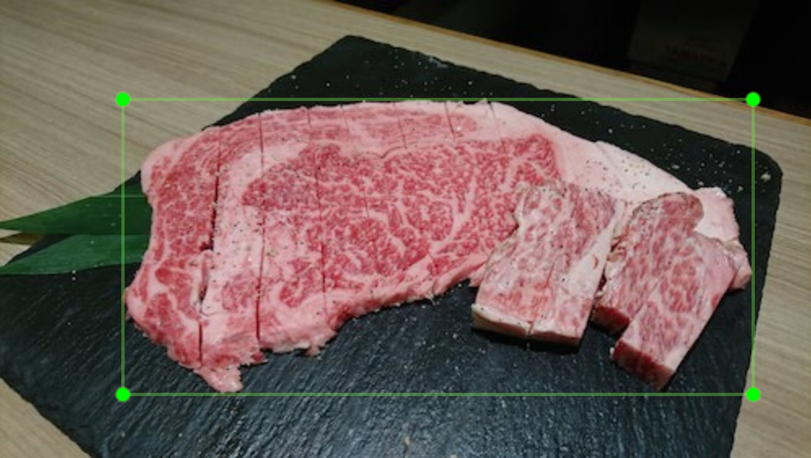
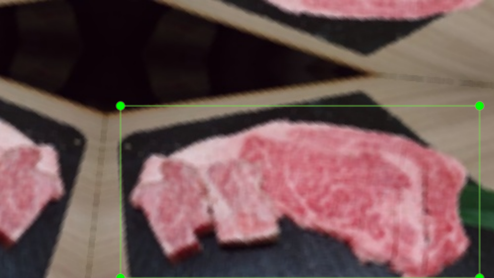
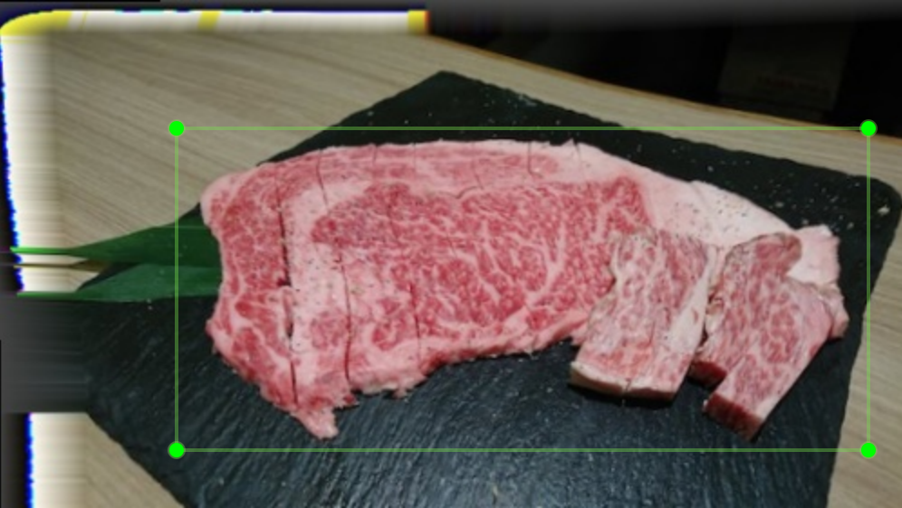
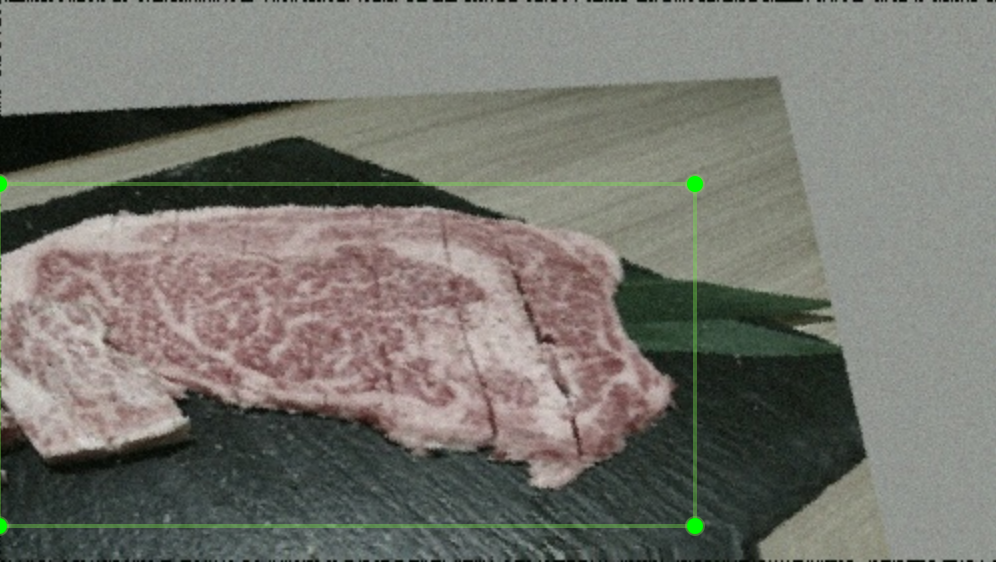
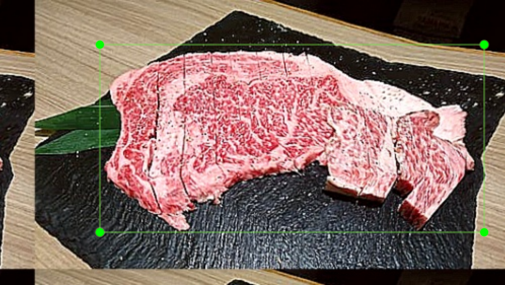

# Bounding Box Augmentation

Example of augmentating image with bounding boxes.
This code is based on [aleju/imgaug](https://github.com/aleju/imgaug).

Augmentable annotation format is Pascal VOC only.

## Examples

Above image can be augmented to the following images.

| Example 1 | Example 2 | Example 3 | Example 4 |
| ---- | ---- | ---- | ---- |
|  |  |  |  |

## Requirements

 * Python3
 * Pipenv

## Usage

Prepare virtualenv with `pipenv`.

    pipenv install

Put files(Images and Annotations) to augment in `input/`.
(Do not create sub directories.)

Run script.

    pipenv run python augment.py

Augmented images and annotations are generated in `output/`.
If there is no bounding boxes in the image, Annotation files (`*.xml`) are moved to `empty/`.